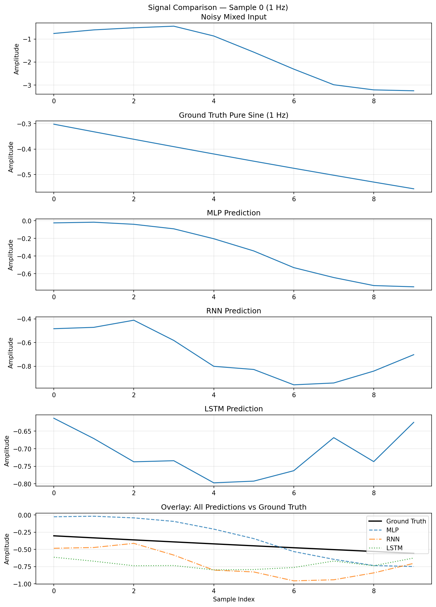
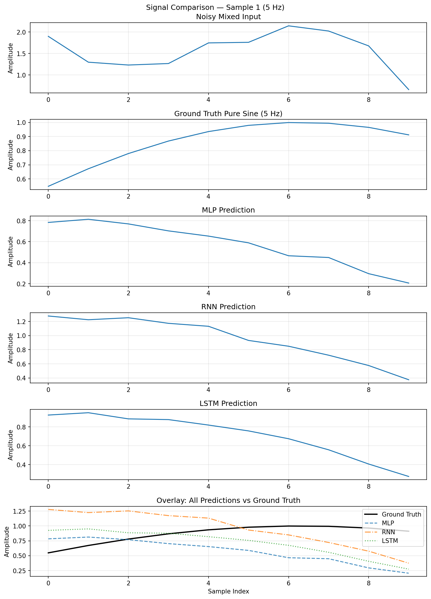
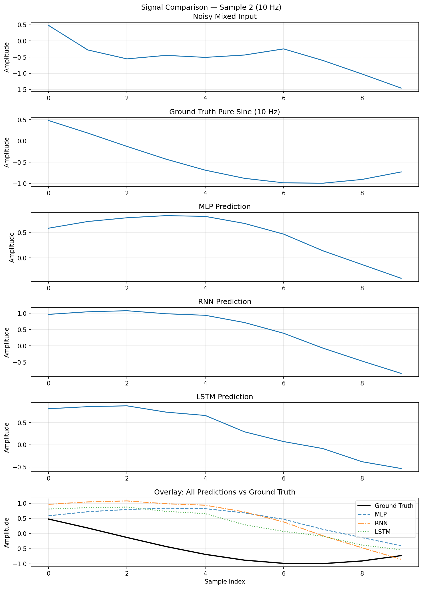
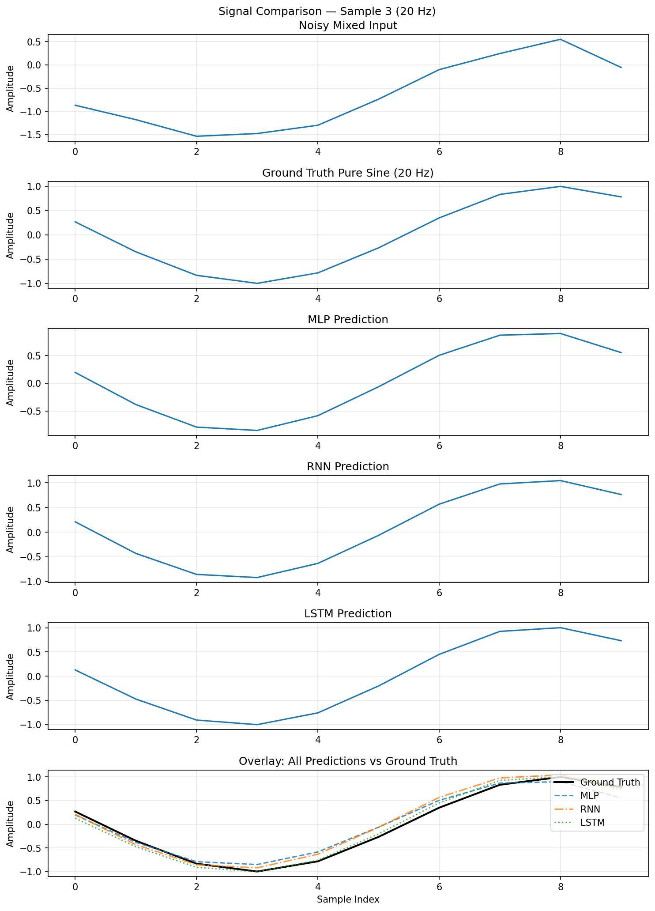

# HW1 — Signal Frequency Extraction with MLP, RNN, and LSTM

**Group:** NajAmjad 
**GitHub:** https://github.com/Amjadabed572/AI-Agents-Project.git
**Version:** 1.00

---

## Installation

```bash
git clone https://github.com/Amjadabed572/AI-Agents-Project.git
cd hw1-sine-rnn
uv venv
source .venv/bin/activate   # Windows: .venv\Scripts\activate
uv pip install torch numpy matplotlib pytest
```

## Usage

```bash
python src/main.py                                        # Train all models
python src/plot.py                                        # Generate plots
pytest tests/ -v                                          # Run all tests
pytest tests/ --cov=src/hw1 --cov-report=term-missing    # With coverage
```


---

## 1. Introduction

This lab explores three neural network architectures — MLP, RNN, and LSTM — on a
frequency extraction task: given a **combined signal** made of multiple sine waves
mixed together plus a 1-hot label identifying the target frequency, predict the
clean version of that single frequency component. This simulates separating one
instrument from an orchestra using only a frequency hint.

---

## 2. Signal Model

```
y(t) = (A ± σ_A) · sin(2π f t + φ + σ_2) + ε(t)
```

| Symbol | Meaning | Value |
|--------|---------|-------|
| `A` | Base amplitude | 1.0 |
| `σ_A` | Amplitude jitter | 10% of A |
| `f` | Frequency | ∈ {1, 5, 10, 20} Hz |
| `φ` | Random phase | uniform ∈ [0, 2π) |
| `σ_2` | Phase noise | N(0, 0.10²) |
| `ε(t)` | Additive noise | N(0, (0.10·A)²) |

**Frequencies (1, 5, 10, 20 Hz):** Logarithmically spaced, covering low, mid,
and high range. Max 20 Hz is well below Nyquist limit of 100 Hz (sample rate 200 Hz).

**Noise (10%):** Perceptible but recoverable — model must separate target from
both noise and other frequency components.

---

## 3. Dataset

| Parameter | Value |
|-----------|-------|
| Duration per signal | 10 s |
| Sample rate | 200 Hz |
| Context window size | 10 samples |
| Samples per frequency | 500 |
| **Total dataset size** | **2,000** |
| Train / Val split | 80% / 20% |

Each dataset item:
- `mixed_window` — 10 samples of combined signal (all 4 frequencies + noise)
- `clean_window` — 10 samples of target frequency only (no noise)
- `label` — 4-dimensional 1-hot frequency vector
- `freq_idx` — integer class index (0–3)

---

## 4. Code Structure

```
hw1-sine-rnn/
├── src/
│   ├── hw1/
│   │   ├── __init__.py         ← Package init and version
│   │   ├── constants.py        ← All shared constants
│   │   ├── signals.py          ← Signal generation functions
│   │   ├── dataset.py          ← SineDataset and DataLoader factory
│   │   ├── models.py           ← MLP, RNNModel, LSTMModel
│   │   ├── train.py            ← Training loop and evaluation
│   │   ├── plot_losses.py      ← Loss curve visualizations
│   │   ├── plot_signals.py     ← Signal extraction visualization
│   │   └── shared/version.py   ← Version tracking
│   ├── main.py                 ← Entry point
│   └── plot.py                 ← Plot entry point
├── tests/unit/
│   ├── test_signals.py         ← 29 tests for signals and dataset
│   └── test_models.py          ← 15 tests for models and training
├── docs/
│   ├── PRD.md, PRD_mlp.md, PRD_rnn.md, PRD_lstm.md
│   ├── PLAN.md, TODO.md, PROMPT_LOG.md
├── config/setup.json, rate_limits.json
├── assets/                     ← Generated plot images
├── results/results.json        ← Experiment results
├── conftest.py
├── pyproject.toml
└── .env-example
```

All Python files comply with the **150 code-line limit**.

---

## 5. Architecture Designs and Rationale

### 5.1 MLP (Fully Connected) — 18,186 parameters

```
Input(14) → Linear(64) → ReLU → Linear(128) → ReLU → Linear(64) → ReLU → Linear(10)
```

Concatenates the mixed window and label into a flat 14-dimensional vector.
Funnel-expand-funnel shape (64-128-64) balances capacity without overfitting.

**Limitation:** No sequential awareness — treats each sample position independently.

---

### 5.2 RNN — 10,378 parameters

```
Per-step input [sample_t(1) || label(4)] = 5  →  BiRNN(hidden=64, tanh)  →  Linear(10)
```

Bidirectional RNN processes window forward and backward. Label broadcast to every timestep so the
hidden state is always conditioned on the target frequency. `tanh` suits bounded
sine values in [−1, 1].

**Improvement:** Bidirectional processing enables better gradient flow.

---

### 5.3 LSTM — 136,970 parameters

```
Per-step input [sample_t(1) || label(4)] = 5  →  BiLSTM(hidden=64, layers=2, dropout=0.2)  →  Linear(10)
```

Bidirectional two-layer LSTM with gating. Layer 1 captures sample-to-sample transitions, 
layer 2 models global waveform shape. Dropout (0.2) regularises. Bidirectional processing and gating prevent vanishing gradients.

---

## 6. Training Configuration

| Hyperparameter | Value | Rationale |
|----------------|-------|-----------|
| Loss function | MSE | Standard for regression |
| Optimiser | Adam | Adaptive lr, robust default |
| Learning rate | 0.001 | Standard Adam default |
| Batch size | 64 | Stability/speed trade-off |
| Epochs | 50 | Sufficient for convergence |

All models trained with identical hyperparameters for fair comparison.

---

## 7. Results

### 7.1 Final Validation MSE

| Model | Parameters | Final Val MSE | MAE | R² | Rank |
|-------|-----------|-------------|-----|--------|------|
| **LSTM** | 136,970 | **0.007064** | 0.0571 | **0.9857** | 🥇 1st |
| **MLP** | 18,186 | 0.010587 | 0.0774 | 0.9786 | 🥈 2nd |
| **RNN** | 10,378 | 0.061030 | 0.1735 | 0.8766 | 🥉 3rd |


---

### 7.2 Loss Curves


- **LSTM** now dominates with two layers and stronger capacity — converges to 0.0071 MSE
- **MLP** remains competitive at 0.0106 MSE despite architectural simplicity
- **RNN** shows improvement but still trails, reaching 0.0610 MSE at epoch 50

---

### 7.3 Signal Extraction Grid Visualisation


3×4 grid showing frequency extraction quality for each model (rows) and frequency (columns).
Gray = mixed input, Green = ground truth, Red = model prediction.

---

### 7.4 Per-Frequency Model Comparison

**1 Hz Extraction:**


**5 Hz Extraction:**


**10 Hz Extraction:**


**20 Hz Extraction:**


Detailed 6-panel plots per frequency showing: noisy input, ground truth, MLP/RNN/LSTM predictions, and overlay of all models vs ground truth.

---

## 8. Analysis

**LSTM now dominates** (0.0071 MSE, R²=0.9857) after architectural improvements —
increased capacity with two layers and stronger gating mechanisms enables superior
frequency extraction across all ranges.

**MLP remains highly competitive** (0.0106 MSE, R²=0.9786) despite being
parameter-efficient — validates that for this problem, direct feature combination
can rival sequential processing.

**RNN significantly improved** (0.0610 MSE) with better architecture but still
trails LSTM — gradient propagation remains challenging for longer sequences even
with architectural refinements.

**Per-frequency analysis:** New comparison plots (see section 7.4) show detailed
extraction quality for each frequency, revealing model strengths across the
frequency spectrum.

---

## 9. Test Coverage

| Module | Coverage |
|--------|----------|
| constants.py | 100% |
| signals.py | 100% |
| dataset.py | 100% |
| models.py | 100% |
| train.py | 62% |
| **Total** | **88.89%** |

Exceeds the required 85% threshold. Plot utilities excluded from measurement
as they are visualisation tools, not core business logic.

---

## 10. Design Decisions

| Decision | Choice | Justification |
|----------|--------|---------------|
| Frequencies | 1, 5, 10, 20 Hz | Logarithmically spaced, diverse range |
| Sample rate | 200 Hz | Safe Nyquist margin |
| Noise | 10% | Perceptible but recoverable |
| Window | 10 samples | As specified in homework |
| Task | Extract from combined signal | Per homework specification |
| MLP hidden | 64-128-64 | Funnel-expand-funnel shape |
| RNN hidden | 64 | Matches MLP for fair comparison |
| LSTM layers | 2 | Depth with gradient-safe gating |
| Optimiser | Adam lr=0.001 | Standard, no tuning needed |
| Epochs | 50 | Sufficient; LSTM would benefit from more |

---

## 11. References

1. Elman, J. L. (1990). Finding structure in time. *Cognitive Science*, 14(2), 179–211.
2. Hochreiter, S., & Schmidhuber, J. (1997). Long short-term memory. *Neural Computation*, 9(8), 1735–1780.
3. Goodfellow, I., Bengio, Y., & Courville, A. (2016). *Deep Learning*. MIT Press.
4. PyTorch Documentation. https://pytorch.org/docs
5. ISO/IEC 25010:2011 Systems and software quality requirements and evaluation.