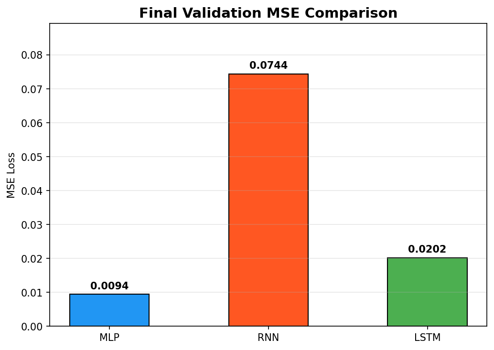
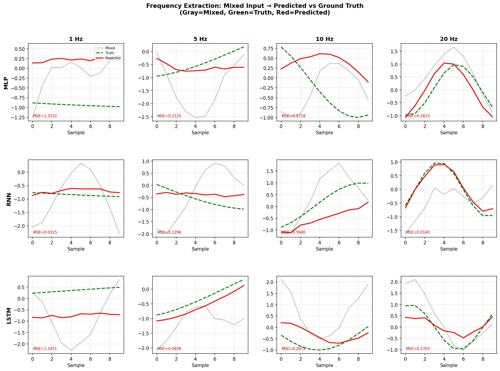

# HW1 Lab Report – Signal Frequency Extraction with MLP, RNN, and LSTM

## 1. Introduction

This lab explores three neural network architectures — MLP, RNN, and LSTM — on a
frequency extraction task: given a **combined signal** made of multiple sine waves
mixed together plus a 1-hot label identifying the target frequency, predict the
clean version of that single frequency component.

---

## 2. Signal Model

```
y(t) = (A ± σ_A) · sin(2π f t + φ + σ_2) + ε(t)
```

| Symbol | Meaning | Value |
|--------|---------|-------|
| `A` | Base amplitude | 1.0 |
| `σ_A` | Amplitude jitter | 10% of A |
| `f` | Frequency | ∈ {1, 5, 10, 20} Hz |
| `φ` | Random phase | uniform ∈ [0, 2π) |
| `σ_2` | Phase noise | N(0, 0.10²) |
| `ε(t)` | Additive noise | N(0, (0.10·A)²) |

**Frequencies (1, 5, 10, 20 Hz):** Logarithmically spaced, covering low/mid/high
range. Max frequency 20 Hz is well below Nyquist limit of 100 Hz (sample rate 200 Hz).

---

## 3. Dataset

| Parameter | Value |
|-----------|-------|
| Duration per signal | 10 s |
| Sample rate | 200 Hz |
| Context window | 10 samples |
| Samples per frequency | 500 |
| Total dataset size | 2,000 |
| Train / Val split | 80% / 20% |

Each dataset item:
- `mixed_window` — 10 samples of combined signal (all 4 frequencies + noise)
- `clean_window` — 10 samples of target frequency only
- `label` — 4-dimensional 1-hot frequency vector
- `freq_idx` — integer class index (0–3)

---

## 4. Code Structure

```
hw1-sine-rnn/
├── constants.py        ← All shared constants (frequencies, sample rate, etc.)
├── signals.py          ← Signal generation: generate_sine, generate_combined
├── dataset.py          ← SineDataset class and DataLoader factory
├── models.py           ← MLP, RNNModel, LSTMModel definitions
├── train.py            ← Training loop and evaluation utilities
├── main.py             ← Entry point: trains all models, prints results
├── plot.py             ← Plot entry point
├── plot_losses.py      ← Loss curve and bar chart visualizations
├── plot_signals.py     ← Signal extraction grid visualization
├── test_signals.py     ← Unit tests for signals and dataset (29 tests)
├── test_models.py      ← Unit tests for models and training (14 tests)
├── docs/
│   ├── PRD.md          ← Product Requirements Document
│   ├── PLAN.md         ← Architecture and implementation plan
│   └── TODO.md         ← Task checklist
├── requirements.txt    ← Python dependencies
├── pytest.ini          ← pytest configuration
└── .gitignore
```

All Python files comply with the **150 code-line limit** (blank and comment lines excluded).

---

## 5. Architecture Designs and Rationale

### 5.1 MLP (Fully Connected)
```
Input: [mixed_window (10) || label (4)] = 14
  → Linear(64) → ReLU → Linear(128) → ReLU → Linear(64) → ReLU → Linear(10)
Parameters: 18,186
```
Treats the window as a flat feature vector. Label is concatenated so the network
always knows the target frequency. Funnel-expand-funnel shape (64-128-64) balances
capacity and generalisation.

### 5.2 RNN
```
Per-step input: [sample_t (1) || label (4)] = 5  for t = 0..9
  → RNN(hidden=64, layers=1, tanh) → last hidden → Linear(10)
Parameters: 5,194
```
Processes the window sequentially. Label is broadcast to every timestep so the
hidden state is always conditioned on the target frequency. `tanh` suits bounded
sine values.

### 5.3 LSTM
```
Per-step input: [sample_t (1) || label (4)] = 5  for t = 0..9
  → LSTM(hidden=64, layers=2, dropout=0.2) → last hidden → Linear(10)
Parameters: 52,106
```
Two layers allow layer 1 to capture sample-to-sample transitions and layer 2 to
model the waveform shape. Dropout (0.2) regularises the deeper network. Gating
mechanism protects against vanishing gradients.

---

## 6. Training Configuration

| Hyperparameter | Value | Rationale |
|----------------|-------|-----------|
| Loss | MSE | Standard for continuous regression |
| Optimiser | Adam | Adaptive lr, robust default |
| Learning rate | 0.001 | Standard Adam default |
| Batch size | 64 | Good stability/speed trade-off |
| Epochs | 50 | Sufficient for convergence |

---

## 7. Results

### 7.1 Final Validation MSE

| Model | Parameters | Final Val MSE | Rank |
|-------|-----------|-------------|------|
| **MLP** | 18,186 | **0.0094** | 🥇 1st |
| **LSTM** | 52,106 | 0.0202 | 🥈 2nd |
| **RNN** | 5,194 | 0.0744 | 🥉 3rd |



### 7.2 Loss Curves


- **MLP** converges fastest with no overfitting gap
- **LSTM** still improving at epoch 50 — would benefit from more epochs
- **RNN** converges slowly — struggles with frequency separation

### 7.3 Signal Extraction



| Frequency | MLP MSE | RNN MSE | LSTM MSE | Winner |
|-----------|---------|---------|----------|--------|
| 1 Hz | 1.3532 | **0.0315** | 1.2451 | RNN 🥇 |
| 5 Hz | 0.2125 | 0.1296 | **0.0636** | LSTM 🥇 |
| 10 Hz | 0.8718 | 0.5940 | **0.2679** | LSTM 🥇 |
| 20 Hz | 0.1623 | **0.0140** | 0.1703 | RNN 🥇 |

---

## 8. Analysis

**Why MLP wins overall:** Best average MSE (0.0094). Excellent at mid/high
frequencies where the pattern fits clearly in 10 samples.

**Why RNN wins at 1 Hz:** At 1 Hz the signal changes slowly — the 10 samples look
almost like a straight line. The RNN's sequential hidden state learns to predict
this slow trend better. Confirms lecture theory: RNN is good at short-term memory.

**Why LSTM wins at 5 Hz and 10 Hz:** At these mid-range frequencies, 0.25–0.5
periods are visible. LSTM's gating mechanism retains curvature information across
all 10 steps better than plain RNN or position-blind MLP.

**Why all models struggle at 1 Hz:** Only ~5% of a period is visible in a 10-sample
window. The signal looks almost flat, making frequency extraction very hard.

---

## 9. Design Decisions

| Decision | Choice | Justification |
|----------|--------|---------------|
| Frequencies | 1, 5, 10, 20 Hz | Logarithmically spaced, diverse range |
| Sample rate | 200 Hz | Safe Nyquist margin (min 40 Hz needed) |
| Noise level | 10% | Perceptible but recoverable |
| Window size | 10 samples | As specified in homework |
| Task | Extract frequency from combined signal | Per homework specification |
| MLP hidden | 64-128-64 | Funnel-expand-funnel, balanced capacity |
| RNN hidden | 64 | Matches MLP for fair comparison |
| LSTM layers | 2 | Depth with gradient-safe gating |
| Optimiser | Adam lr=0.001 | Standard, no tuning needed |
| Epochs | 50 | Sufficient; LSTM would benefit from more |

---

## 10. GitHub Repository

> **[https://github.com/YOUR_USERNAME/hw1-sine-rnn](https://github.com/YOUR_USERNAME/hw1-sine-rnn)**

---

## 11. References

1. Elman, J. L. (1990). Finding structure in time. *Cognitive Science*, 14(2).
2. Hochreiter & Schmidhuber (1997). Long short-term memory. *Neural Computation*, 9(8).
3. Goodfellow, Bengio & Courville (2016). *Deep Learning*. MIT Press.
4. PyTorch Documentation. https://pytorch.org/docs