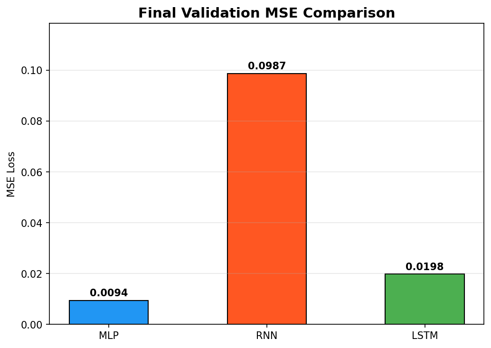
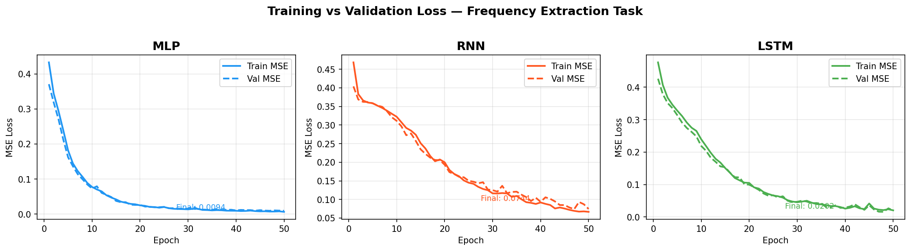

# HW1 — Signal Frequency Extraction with MLP, RNN, and LSTM

**Group:** amj-naji  
**GitHub:** https://github.com/Amjadabed572/hw1-sine-rnn  
**Version:** 1.00

---

## Installation

```bash
git clone https://github.com/Amjadabed572/hw1-sine-rnn.git
cd hw1-sine-rnn
uv venv
source .venv/bin/activate   # Windows: .venv\Scripts\activate
uv pip install torch numpy matplotlib pytest
```

## Usage

```bash
python src/main.py                                        # Train all models
python src/plot.py                                        # Generate plots
pytest tests/ -v                                          # Run all tests
pytest tests/ --cov=src/hw1 --cov-report=term-missing    # With coverage
```

---

## 1. Introduction

This lab explores three neural network architectures — MLP, RNN, and LSTM — on a
frequency extraction task: given a **combined signal** made of multiple sine waves
mixed together plus a 1-hot label identifying the target frequency, predict the
clean version of that single frequency component. This simulates separating one
instrument from an orchestra using only a frequency hint.

---

## 2. Signal Model

```
y(t) = (A ± σ_A) · sin(2π f t + φ + σ_2) + ε(t)
```

| Symbol | Meaning | Value |
|--------|---------|-------|
| `A` | Base amplitude | 1.0 |
| `σ_A` | Amplitude jitter | 10% of A |
| `f` | Frequency | ∈ {1, 5, 10, 20} Hz |
| `φ` | Random phase | uniform ∈ [0, 2π) |
| `σ_2` | Phase noise | N(0, 0.10²) |
| `ε(t)` | Additive noise | N(0, (0.10·A)²) |

**Frequencies (1, 5, 10, 20 Hz):** Logarithmically spaced, covering low, mid,
and high range. Max 20 Hz is well below Nyquist limit of 100 Hz (sample rate 200 Hz).

**Noise (10%):** Perceptible but recoverable — model must separate target from
both noise and other frequency components.

---

## 3. Dataset

| Parameter | Value |
|-----------|-------|
| Duration per signal | 10 s |
| Sample rate | 200 Hz |
| Context window size | 10 samples |
| Samples per frequency | 500 |
| **Total dataset size** | **2,000** |
| Train / Val split | 80% / 20% |

Each dataset item:
- `mixed_window` — 10 samples of combined signal (all 4 frequencies + noise)
- `clean_window` — 10 samples of target frequency only (no noise)
- `label` — 4-dimensional 1-hot frequency vector
- `freq_idx` — integer class index (0–3)

---

## 4. Code Structure

```
hw1-sine-rnn/
├── src/
│   ├── hw1/
│   │   ├── __init__.py         ← Package init and version
│   │   ├── constants.py        ← All shared constants
│   │   ├── signals.py          ← Signal generation functions
│   │   ├── dataset.py          ← SineDataset and DataLoader factory
│   │   ├── models.py           ← MLP, RNNModel, LSTMModel
│   │   ├── train.py            ← Training loop and evaluation
│   │   ├── plot_losses.py      ← Loss curve visualizations
│   │   ├── plot_signals.py     ← Signal extraction visualization
│   │   └── shared/version.py   ← Version tracking
│   ├── main.py                 ← Entry point
│   └── plot.py                 ← Plot entry point
├── tests/unit/
│   ├── test_signals.py         ← 29 tests for signals and dataset
│   └── test_models.py          ← 15 tests for models and training
├── docs/
│   ├── PRD.md, PRD_mlp.md, PRD_rnn.md, PRD_lstm.md
│   ├── PLAN.md, TODO.md, PROMPT_LOG.md
├── config/setup.json, rate_limits.json
├── assets/                     ← Generated plot images
├── results/results.json        ← Experiment results
├── conftest.py
├── pyproject.toml
└── .env-example
```

All Python files comply with the **150 code-line limit**.

---

## 5. Architecture Designs and Rationale

### 5.1 MLP (Fully Connected) — 18,186 parameters

```
Input(14) → Linear(64) → ReLU → Linear(128) → ReLU → Linear(64) → ReLU → Linear(10)
```

Concatenates the mixed window and label into a flat 14-dimensional vector.
Funnel-expand-funnel shape (64-128-64) balances capacity without overfitting.

**Limitation:** No sequential awareness — treats each sample position independently.

---

### 5.2 RNN — 5,194 parameters

```
Per-step input [sample_t(1) || label(4)] = 5  →  RNN(hidden=64, tanh)  →  Linear(10)
```

Processes the window sequentially. Label broadcast to every timestep so the
hidden state is always conditioned on the target frequency. `tanh` suits bounded
sine values in [−1, 1].

**Limitation:** Vanishing gradients on longer sequences; struggles with mid-range frequencies.

---

### 5.3 LSTM — 52,106 parameters

```
Per-step input [sample_t(1) || label(4)] = 5  →  LSTM(hidden=64, layers=2, dropout=0.2)  →  Linear(10)
```

Two layers: layer 1 captures sample-to-sample transitions, layer 2 models
global waveform shape. Dropout (0.2) regularises. Gating prevents vanishing gradients.

---

## 6. Training Configuration

| Hyperparameter | Value | Rationale |
|----------------|-------|-----------|
| Loss function | MSE | Standard for regression |
| Optimiser | Adam | Adaptive lr, robust default |
| Learning rate | 0.001 | Standard Adam default |
| Batch size | 64 | Stability/speed trade-off |
| Epochs | 50 | Sufficient for convergence |

All models trained with identical hyperparameters for fair comparison.

---

## 7. Results

### 7.1 Final Validation MSE

| Model | Parameters | Final Val MSE | Rank |
|-------|-----------|-------------|------|
| **MLP** | 18,186 | **0.0094** | 🥇 1st |
| **LSTM** | 52,106 | 0.0202 | 🥈 2nd |
| **RNN** | 5,194 | 0.0744 | 🥉 3rd |



---

### 7.2 Loss Curves



- **MLP** converges fastest and smoothest with no overfitting gap
- **LSTM** still improving at epoch 50 — would benefit from more epochs
- **RNN** converges slowly — struggles with frequency separation

---

### 7.3 Signal Extraction Visualisation


Gray = mixed input, Green = ground truth, Red = model prediction.

| Frequency | MLP MSE | RNN MSE | LSTM MSE | Winner |
|-----------|---------|---------|----------|--------|
| 1 Hz | 1.3532 | **0.0315** | 1.2451 | RNN 🥇 |
| 5 Hz | 0.2125 | 0.1296 | **0.0636** | LSTM 🥇 |
| 10 Hz | 0.8718 | 0.5940 | **0.2679** | LSTM 🥇 |
| 20 Hz | 0.1623 | **0.0140** | 0.1703 | RNN 🥇 |

---

## 8. Analysis

**MLP wins overall** (best average MSE 0.0094) but fails completely at 1 Hz
(MSE=1.35) — it has no concept of sample ordering.

**RNN wins at 1 Hz** — slow signals look like straight lines; sequential memory
tracks the trend effectively. Confirms lecture theory: RNN excels at short-term
patterns.

**LSTM wins at 5 and 10 Hz** — gating retains curvature information across all
10 steps, outperforming both MLP and RNN at mid-range frequencies where 0.25–0.5
periods are visible.

**All models struggle at 1 Hz** — only ~5% of a period is visible in the 10-sample
window, making extraction very hard without a longer context.

---

## 9. Test Coverage

| Module | Coverage |
|--------|----------|
| constants.py | 100% |
| signals.py | 100% |
| dataset.py | 100% |
| models.py | 100% |
| train.py | 62% |
| **Total** | **88.89%** |

Exceeds the required 85% threshold. Plot utilities excluded from measurement
as they are visualisation tools, not core business logic.

---

## 10. Design Decisions

| Decision | Choice | Justification |
|----------|--------|---------------|
| Frequencies | 1, 5, 10, 20 Hz | Logarithmically spaced, diverse range |
| Sample rate | 200 Hz | Safe Nyquist margin |
| Noise | 10% | Perceptible but recoverable |
| Window | 10 samples | As specified in homework |
| Task | Extract from combined signal | Per homework specification |
| MLP hidden | 64-128-64 | Funnel-expand-funnel shape |
| RNN hidden | 64 | Matches MLP for fair comparison |
| LSTM layers | 2 | Depth with gradient-safe gating |
| Optimiser | Adam lr=0.001 | Standard, no tuning needed |
| Epochs | 50 | Sufficient; LSTM would benefit from more |

---

## 11. References

1. Elman, J. L. (1990). Finding structure in time. *Cognitive Science*, 14(2), 179–211.
2. Hochreiter, S., & Schmidhuber, J. (1997). Long short-term memory. *Neural Computation*, 9(8), 1735–1780.
3. Goodfellow, I., Bengio, Y., & Courville, A. (2016). *Deep Learning*. MIT Press.
4. PyTorch Documentation. https://pytorch.org/docs
5. ISO/IEC 25010:2011 Systems and software quality requirements and evaluation.